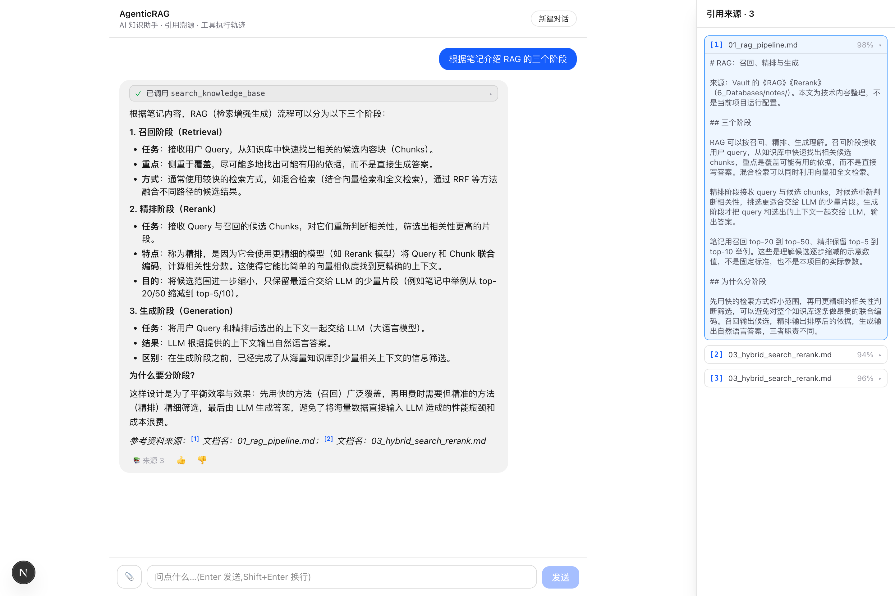

# AgenticRAG

**将个人笔记变成可追问、可溯源的 AI 知识助手。**

上传文档后，用户通过统一聊天入口提问，由 Agent 按需检索知识库、组织回答，并展示引用原文与工具执行过程。



## 主要功能

- **统一问答入口**：无需切换 RAG / Agent 模式，AI 知识问题优先检索笔记，其他问题由 Agent 判断如何回答。
- **可追溯的回答**：点击回答中的引用编号，查看对应文档与原文片段。
- **可见的执行过程**：展示工具调用参数、执行状态和返回内容，让用户了解回答的依据。
- **连续追问**：保留会话上下文，围绕同一主题继续提问。
- **文档与对话**：支持 Markdown、TXT、PDF 上传，以及流式回答、停止生成和新建对话。

## 技术栈

- **前端**：Next.js、React、TypeScript
- **后端与 Agent**：FastAPI、LangChain、LangGraph
- **存储与检索**：PostgreSQL、pgvector、zhparser、Redis
- **评测与观测**：Ragas、Prometheus

## 快速启动

需要 Docker Compose 和可用的 OpenAI 兼容模型服务配置。从仓库根目录执行，已有 `.env` 时保留原配置：

```bash
cp .env.example .env
# 填写模型服务地址、API Key 与模型名称
docker compose up --build
```

打开 **http://127.0.0.1:3000**，上传 [AI 示例语料](services/knowledge/scripts/test_data/documents/)，尝试：

1. “根据笔记，RAG 的召回、精排和生成分别负责什么？”
2. 点击回答中的引用，查看来源原文。
3. 继续追问：“为什么不能省略召回，直接对全库做精排？”

<details>
<summary>分服务启动与测试命令</summary>

需要 Python 3.12、Node.js 20.9+。先配置根目录 `.env`，以下服务分别在独立终端运行。

```bash
docker compose up -d postgres redis

# Knowledge
python3.12 -m venv services/knowledge/.venv
services/knowledge/.venv/bin/pip install -r services/knowledge/requirements.txt
PYTHONPATH=services/knowledge services/knowledge/.venv/bin/python -m scripts.init_db
services/knowledge/.venv/bin/uvicorn --app-dir services/knowledge app.main:app --port 8000

# Agent：先初始化 checkpoint 表，再启动服务
python3.12 -m venv services/agent/.venv
services/agent/.venv/bin/pip install -r services/agent/requirements.txt
PYTHONPATH=services/agent services/agent/.venv/bin/python -m scripts.init_checkpointer
services/agent/.venv/bin/uvicorn --app-dir services/agent app.main:app --port 8100

# Web
npm --prefix apps/web ci
npm --prefix apps/web run dev
```

测试与检查：

```bash
PYTHONPATH=services/agent services/agent/.venv/bin/python -B -m unittest discover -s services/agent/tests -v
npm --prefix apps/web test
npm --prefix apps/web run lint
npm --prefix apps/web run build
docker compose config --quiet

# 可选：在数据库中创建并清理随机测试 schema，验证持久化
AGENT_POSTGRES_TEST=1 PYTHONPATH=services/agent services/agent/.venv/bin/python -B -m unittest discover -s services/agent/tests -p test_postgres.py -v
```

API 文档：Knowledge http://127.0.0.1:8000/docs · Agent http://127.0.0.1:8100/docs

</details>

## 文档

- [系统架构与接口约定](docs/architecture.md)
- [RAG 离线评测](eval/README.md)
- [测试语料与问题说明](services/knowledge/scripts/test_data/README.md)
