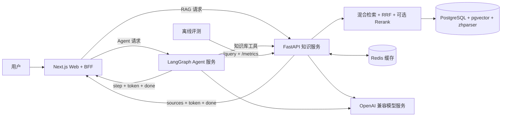
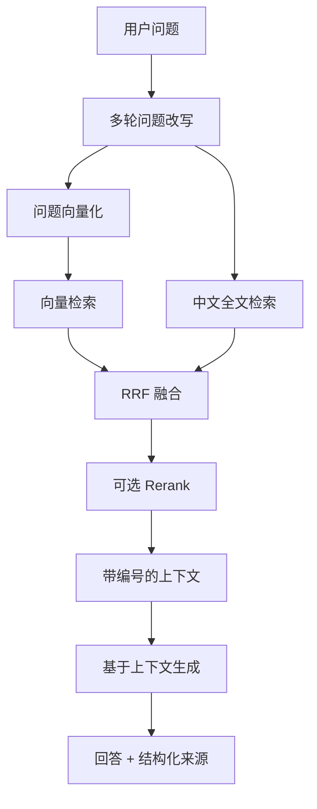

# AgenticRAG 架构

AgenticRAG 采用模块化单仓库（monorepo）：Web 负责产品交互和 BFF，知识服务负责文档入库与 RAG，Agent 服务负责编排和工具调用，离线评测模块通过黑盒方式衡量回答质量与性能。

## 系统总览



## RAG 流程



知识服务将原始问题用于最终生成，将改写后的独立问题用于检索；引用元数据始终通过结构化 `sources` 返回给应用层。

### Retrieval-only 接口

`POST /retrieve` 只执行混合检索、RRF 与可选 Rerank，不调用回答模型，也不创建或写入会话。它与 `/query` 复用同一条检索链路和 `Source` 结构，供 Agent 等上层编排直接消费检索能力。

```json
{
  "query": "pgvector 如何计算向量相似度？",
  "top_k": 5
}
```

响应只包含按相关性排序的结构化来源：

```json
{
  "sources": [
    {
      "id": 1,
      "chunk_id": 42,
      "document_id": 7,
      "document_filename": "pgvector.md",
      "chunk_index": 3,
      "content": "...",
      "similarity": 0.82,
      "vector_rank": 1,
      "keyword_rank": 2,
      "rerank_score": null
    }
  ]
}
```

## 模块职责

| 模块 | 职责 | 主要接口 |
|---|---|---|
| `apps/web` | 对话界面、文档上传、SSE 解析、来源面板、工具执行轨迹 | `/api/chat`、`/api/agent`、`/api/upload` |
| `services/knowledge` | 文档入库、检索、生成、会话、缓存、指标 | `/upload`、`/retrieve`、`/query`、`/query/stream`、`/metrics` |
| `services/agent` | 工具选择、LangGraph 编排、Agent SSE | `/agent/stream` |
| `eval` | 数据集采集、Ragas 评分、性能测试、Prompt A/B | `/query`、`/metrics` |

## 流式接口约定

### 知识服务

```text
sources { sources }
token   { text }
done    { conversation_id }
error   { message }
```

### Agent 服务

```text
step    { id, tool, status: running, input }
step    { id, tool, status: done, output }
token   { content }
done    {}
error   { message }
```

Next.js 路由处理器作为 BFF 透传上游 SSE；浏览器分别通过 `ragReduce` 与 `agentReduce` 将语义帧归并为界面状态。

## 数据与可观测性

- PostgreSQL 保存文档、文本块、会话与消息；pgvector 负责向量距离计算，zhparser 支持中文全文检索。
- Redis 缓存向量结果与首轮回答。
- 知识服务使用 structlog 记录结构化日志，并通过 `X-Trace-Id` 串联请求。
- Prometheus 指标覆盖请求量、延迟、检索候选、Token 与成本。
- 离线评测通过 HTTP 黑盒采集回答与上下文，再生成质量和性能报告。
