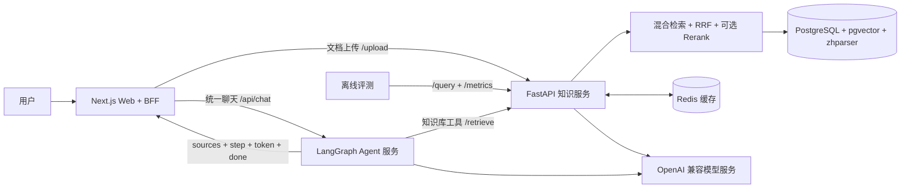
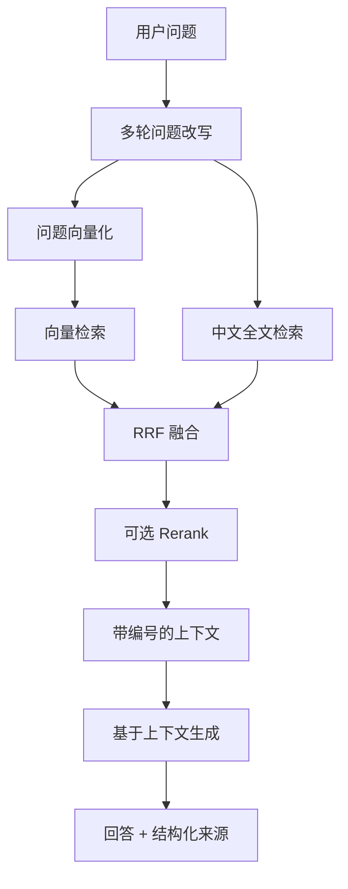

# AgenticRAG 架构

AgenticRAG 采用模块化单仓库（monorepo）：Web 负责产品交互和 BFF，知识服务负责文档入库与 RAG，Agent 服务负责编排和工具调用，离线评测模块通过黑盒方式衡量回答质量与性能。

## 系统总览



## RAG 流程



知识服务将原始问题用于最终生成，将改写后的独立问题用于检索；引用元数据始终通过结构化 `sources` 返回给应用层。

### Retrieval-only 接口

`POST /retrieve` 只执行混合检索、RRF 与可选 Rerank，不调用回答模型，也不创建或写入会话。它与 `/query` 复用同一条检索链路和 `Source` 结构，供 Agent 等上层编排直接消费检索能力。

```json
{
  "query": "pgvector 如何计算向量相似度？",
  "top_k": 5
}
```

响应只包含按相关性排序的结构化来源：

```json
{
  "sources": [
    {
      "id": 1,
      "chunk_id": 42,
      "document_id": 7,
      "document_filename": "pgvector.md",
      "chunk_index": 3,
      "content": "...",
      "similarity": 0.82,
      "vector_rank": 1,
      "keyword_rank": 2,
      "rerank_score": null
    }
  ]
}
```

Agent 的 `search_knowledge_base` 调用 `/retrieve`（`top_k=3`），通过 `content_and_artifact` 返回两份数据：模型可见的带 `[n]` 编号的原文，以及 `ToolMessage.artifact` 中的完整 `sources`。无结果时 artifact 为 `{"sources": []}`；HTTP、超时或响应校验错误继续向上抛出。Agent SSE 在知识库工具成功返回有效 artifact 后、`step(done)` 前发送独立的 `sources` 事件，保留完整来源字段及原引用编号；空列表也会发送。无 artifact、其他工具或错误 ToolMessage 不发送来源；无效 artifact 的校验异常由 Router 转为 `error` 事件，不发送正常 `done`。

每次检索单独发送 `sources`，通过 `tool_call_id` 关联对应工具调用，不在 SSE 层合并或重新编号。引用编号仅在单次检索内有效，多次检索的编号统一仍需在编排层处理；仅有 `tool_call_id` 不能消除答案中重复 `[1]` 的歧义。前端 `chatReduce` 已消费该事件，复用来源面板与 citation 点击。来源按 tool_call_id 分组保存，仅合并无歧义编号；同号不同片段不生成引用链接，并提示从工具轨迹查看原文，不擅自重编号。

## 模块职责

| 模块 | 职责 | 主要接口 |
|---|---|---|
| `apps/web` | 对话界面、文档上传、SSE 解析、来源面板、工具执行轨迹 | `/api/chat`、`/api/upload`（旧 `/api/agent` 返回 410） |
| `services/knowledge` | 文档入库、检索、生成、会话、缓存、指标 | `/upload`、`/retrieve`、`/query`、`/query/stream`、`/metrics` |
| `services/agent` | 工具选择、LangGraph 编排、Agent SSE | `/agent/stream` |
| `eval` | 数据集采集、Ragas 评分、性能测试、Prompt A/B | `/query`、`/metrics` |

## 流式接口约定

### 知识服务

```text
sources { sources }
token   { text }
done    { conversation_id }
error   { message }
```

### Agent 服务

```text
step    { id, tool, status: running, input }
sources { tool_call_id, sources }
step    { id, tool, status: done, output }
token   { content }
done    { thread_id }
error   { message }
```

Next.js `/api/chat` 统一代理 Agent `/agent/stream`，转发 question、thread_id 和请求取消信号。浏览器通过 `chatReduce` 同时处理来源、工具轨迹和回答；不再提供 RAG/Agent 切换。`/api/agent` 暂停用并返回 410，源码已无调用，待确认外部调用迁移后删除。上传仍由 `/api/upload` 直达 Knowledge `/upload`，不经过 Agent。

### Agent 多轮与持久化

`POST /agent/stream` 接收 `{"question": "...", "thread_id": "可选"}`。不传或传 null 时生成 UUID；传入已有 ID 时从 PostgreSQL checkpoint 恢复历史。ID 允许 1–128 位字母、数字、下划线或连字符；未使用过的合法 ID 会创建新会话。每轮只追加本轮 HumanMessage，不重复提交整段历史。正常结束的 `done.thread_id` 用于下一轮请求，与 Knowledge 的 `conversation_id` 互相独立。

Agent 使用 `AsyncPostgresSaver` 和 psycopg 异步连接池。部署前独立执行 `python -m scripts.init_checkpointer`，由 `setup()` 创建或迁移 checkpoint 表；FastAPI lifespan 只建立连接、构建 Agent，退出时关闭连接池，不执行 DDL。Docker Compose 的一次性 `agent-init` 服务等待 PostgreSQL 健康后初始化，Agent 通过 `service_completed_successfully` 等待它成功退出；镜像同时包含 app 和 scripts。初始化失败会阻止 Compose 启动 Agent，本地也必须确认脚本成功后再启动服务。

配置优先使用 `AGENT_DATABASE_URL`，未设置时复用 `DATABASE_URL`（兼容项目的 `postgresql+psycopg://` 前缀）。缺少配置或连接失败会阻止启动，不会静默退回内存存储。运行阶段不检查迁移版本、不自动补建表，本地漏执行初始化时可能在首次请求才报缺表错误。参考 [LangGraph AsyncPostgresSaver](https://reference.langchain.com/python/langgraph.checkpoint.postgres/aio/AsyncPostgresSaver)。

持久化范围包括 Agent 消息状态、工具消息和 artifact；不是聊天列表 API，也不是长期语义记忆。服务重启后，使用同一数据库和 thread_id 可恢复状态。依赖为 `langgraph-checkpoint-postgres`、`psycopg[binary,pool]`，不会复用 Knowledge 的 SQLAlchemy Session。

当前边界：

- 采用单 worker / 单实例部署，同会话并发请求返回 `error: ThreadBusyError`，不同会话可以并行。进程内保护不能协调多实例，扩容前需分布式互斥。数据库迁移已独立为部署步骤，初始化任务应串行执行，避免多个任务同时迁移。
- checkpoint 可能在中途已写入。错误或停止不回滚已写历史，也不自动重放工具；用同一问题重试会追加新消息，尚无请求级幂等或分支重生成。
- API 自动生成的 ID 仍只在正常 done 中返回；Web 在首轮先生成 UUID 并随请求发送，后续校验 done.thread_id，从而保留首轮中断时的 ID。新建对话清空本地消息并更换 ID，不删除 PostgreSQL 历史；刷新页面不恢复本地会话。无历史裁剪或过期清理，长对话会增加上下文和存储开销。
- thread_id 不是鉴权凭证。当前没有用户所有权校验，不能作为多用户公网服务直接开放。
- Web 已传递 thread_id 并支持连续追问。停止/错误保留已显示内容；重新发送会追加新一轮，不回滚已写 checkpoint；持续出错需新建对话。新建对话后旧响应不能回写新状态。完整流必须收到 done，否则显示断流错误。跨次检索/跨轮引用编号统一尚未实现，本轮不继承旧回答的 sources，避免凭历史编号绑定来源。

## 数据与可观测性

- PostgreSQL 保存文档、文本块、会话与消息；pgvector 负责向量距离计算，zhparser 支持中文全文检索。
- Redis 缓存向量结果与首轮回答。
- 知识服务使用 structlog 记录结构化日志，并通过 `X-Trace-Id` 串联请求。
- Prometheus 指标覆盖请求量、延迟、检索候选、Token 与成本。
- 离线评测通过 HTTP 黑盒采集回答与上下文，再生成质量和性能报告。
